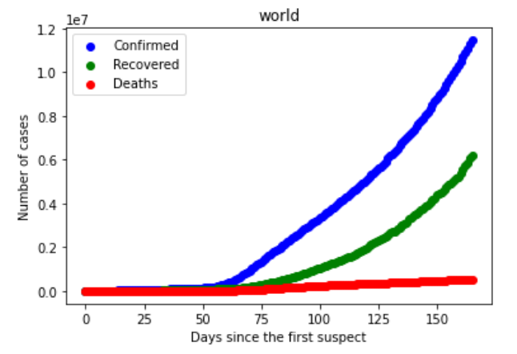

<h1 align="center">COVID-19 Trend Analysis</h1>
<a href="#">
  

    
  

</a>

## Working
In this Jupyter Notebook, I've done the Data Analysis of COVID-19 Dataset, and try to explore the trends in the `Confirmed`, `Deaths` and `Recovered` cases in all the **countries** and overall in **world**.

## Author
You can get in touch with me on my LinkedIn Profile:

#### Daud Ahmad

You can follow my GitHub Profile to stay updated about my latest projects: 

You can also follow me on my Kaggle Profile to stay updated about my latest projects related to **Data Analysis, Data Science, Machine Learning and Natural Language Processing**: 

If you liked the repo then kindly support it by giving it a star ⭐!

---
